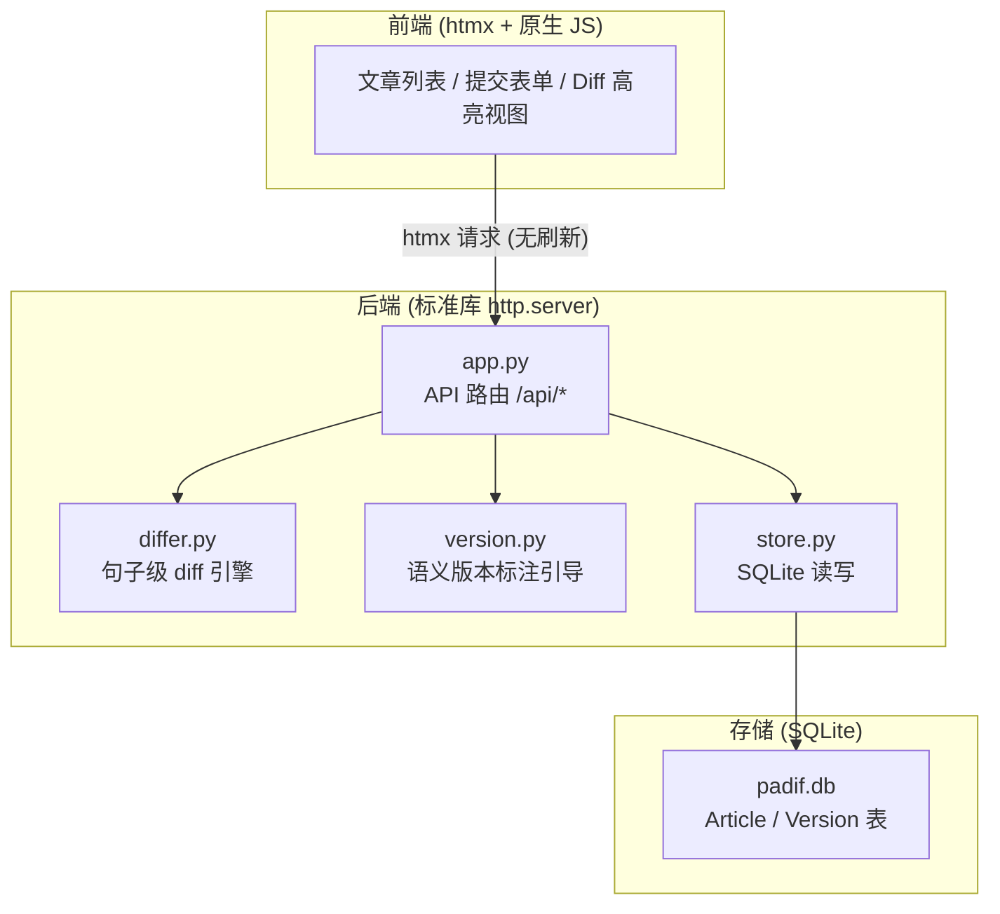
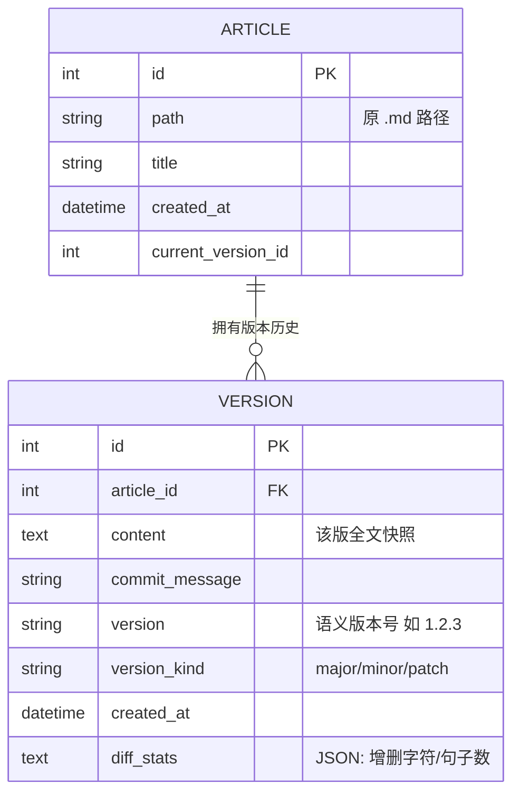
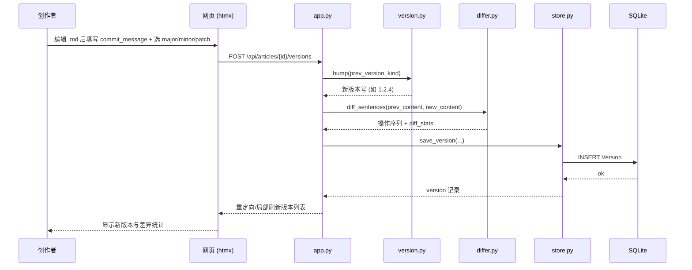
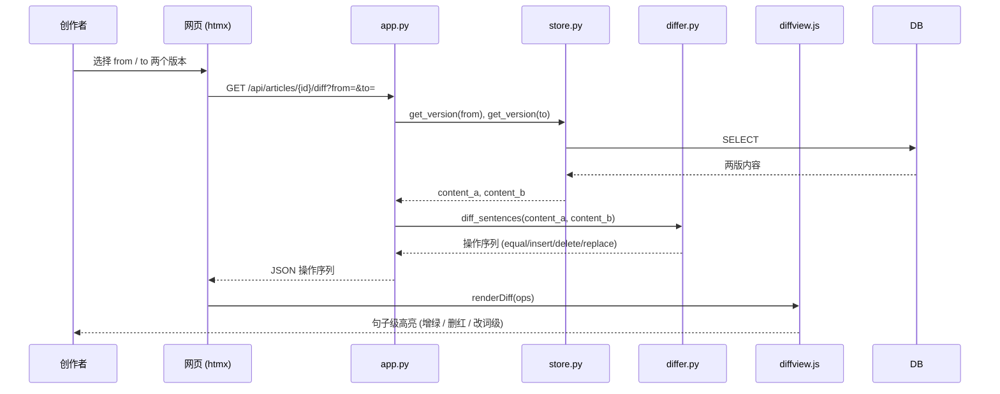
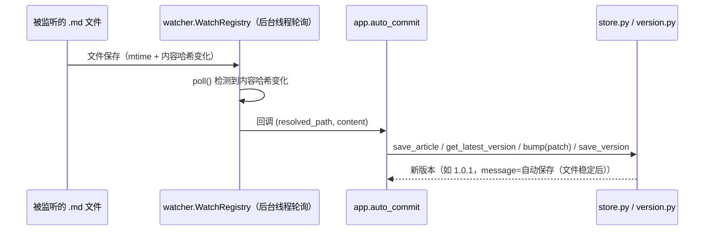
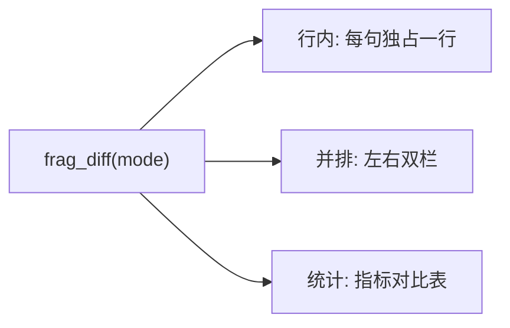
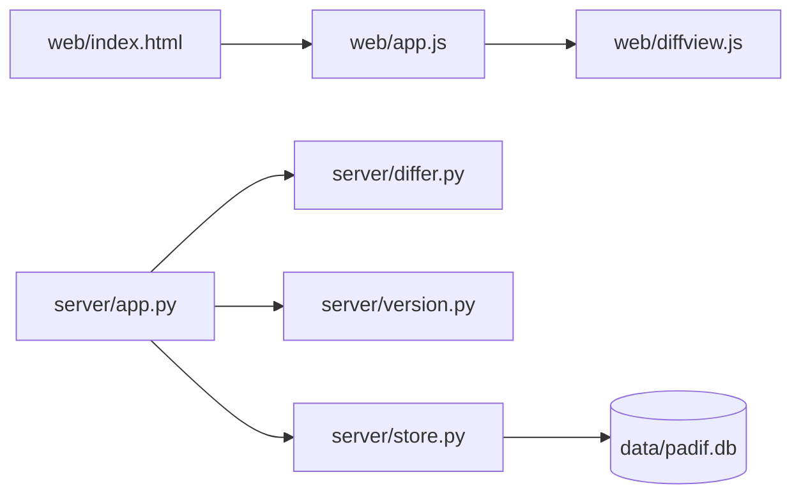

# PAdif 模块 — 开发者文档

> **模块**: `padif/`  
> **职责**: 轻量化文章版本监管与句子级差异对比工具（网页 MVP，后续可迭代为 Obsidian 插件）  
> **依赖**: Python 3.12 · 标准库 http.server · difflib · htmx · SQLite  
> **注**: 原选型为 FastAPI，但当前 managed Python 环境无法安装第三方包（OpenSSL/网络限制导致 pip 安装中断），MVP 改用标准库 `http.server` 实现，路由与业务逻辑已与框架解耦，后续可平滑迁移回 FastAPI/uvicorn。
> **创建**: 2026-07-07  
> **更新**: 2026-07-07 — v1.3：监听三道闸门——稳定窗口由 5s 拉长至 30s（`_WATCH_DEBOUNCE`）、新增最小提交周期 180s（`_WATCH_MIN_INTERVAL`）、新增关闭编辑器即提交（`_WATCH_CLOSE_PROC` 默认 `Obsidian.exe`，进程由在→不在 强制 flush）；三变量均支持 `PADIF_WATCH_*` 环境变量覆盖；`_editor_present` 修复中文 Windows 下 `tasklist` GBK 解码崩溃；哲学明确：自动提交仅作便利，手动提交（带 message 回顾思路）才是主线
> **文档权限**: 架构 / 编码约束 / API / 数据模型的权威源（技术事实唯一裁决）。详见 `DOCUMENTATION_GUIDE.md`。

---

## 0. 版本记录

| 版本 | 日期 | 变更 |
|------|------|------|
| v0.1 | 2026-07-07 | 初始化 `DEVELOPMENT.md`：架构图、目录映射、数据模型 ER 图、核心流程时序图、API 列表、编码规范与开发约束 |
| v0.2 | 2026-07-07 | 同步 MVP 落地状态：后端修正为「标准库 http.server」、补全实际函数名与 `/frag/*` 端点、端口 18887（支持 `PADIF_PORT`）、新增句子移动噪声与 T7 已知项、填充运行 / DB / git 附录 |
| v0.3 | 2026-07-07 | 实现并排双栏差异视图：`frag_diff` 支持 `?mode=split`，新增 `_render_split`（左栏删红、右栏增绿）；`frag_versions` 加行内/并排切换；`index.html` 补双栏样式 |
| v0.4 | 2026-07-07 | 新增 Diff 粒度策略（散文句子级 / 类代码行级 / 结构化健壮性优先）与测试集约定；CONTEXT.md 调整为本地非跟踪参考 |
| v0.5 | 2026-07-07 | Phase 2 统计摘要视图：`frag_diff` 支持 `?mode=stats`，新增 `_render_stats` + `differ.summarize()`（字数/句数/段数/行数 + 变化量）；`frag_versions` 加「统计」切换；`index.html` 补表格样式 |
| v0.6 | 2026-07-07 | 修复「查看差异」按钮无响应：`app.js` 用 `innerHTML` 注入片段后浏览器不会自动重扫 htmx，须显式 `htmx.process(node)`；文章链接改 `onclick` 直连；`frag_diff` 增加同版本对比提示 |
| v0.7 | 2026-07-07 | 修复不同版本也误报「请选择两个版本」：`hx-include` 的 `<select>` 缺 `name` 属性导致 `from/to` 参数空发；并默认 `#from` 选最早、`#to` 选最新版本 |
| v0.8 | 2026-07-07 | Phase 2 收官——句子移动检测降噪：`differ` 新增 `moved` 操作（内容相同仅位置变化），全局配对 + 位置偏移判定；重排段落不再产生红/绿噪声；相似度 <0.5 退化为纯增删以防误配字符级高亮 |
| v0.9 | 2026-07-07 | 文档同步：GUIDE / DEVELOPMENT 标记 P0–P2 完成、Phase 3（文件自动检测提交）列为下一站；新增 `samples/` 测试 fixture（`padif-devlog-v1.md` / `-v2.md`）覆盖句内替换 / 句末插入 / 段落移动 / 列表新增 / 代码注释改写；已知项「句子移动噪声」标记已解决 |
| v1.0 | 2026-07-07 | Phase 3 完成——文件自动检测提交：`server/watcher.py`（零依赖轮询 mtime + 内容 sha1）、`app.py` 后台守护线程 + `auto_commit()`、`/api/watch` 增删查端点、前端监听面板；P0–P3 全部完成 |
| v1.1 | 2026-07-07 | 文档同步：P4/P5 对调——P4 改为「T7 前端优化（收尾）」作为 V1 主线下一站，P5 改为「Obsidian 插件形态」并明确计划在 V2 产品迭代中落地；修正此前「插件已在 v2 迭代」措辞为「将在 V2 迭代」 |
| v1.2 | 2026-07-07 | 防误提交：`_watcher_loop` 增加 `_WATCH_DEBOUNCE = 5.0` 稳定窗口——文件变化后等待连续 N 秒无变化才提交，Obsidian 自动保存的连续写入折叠为「停顿即提交」，避免每敲一字生成一个版本；自动化测试验证 5 次快速改写仅产出 1 个版本 |
| v1.3 | 2026-07-07 | 监听三道闸门（防误提交 + 防刷屏 + 关闭即提）：① 稳定窗口由 5s 拉长为 `_WATCH_DEBOUNCE = 30.0`；② 新增最小提交周期 `_WATCH_MIN_INTERVAL = 180.0`（两次自动提交最小间隔，应对写作的不可预测间断）；③ 新增关闭编辑器即提交——`_editor_present(proc)` 检测进程（默认 `Obsidian.exe`，`_WATCH_CLOSE_PROC` 置空禁用），进程由在→不在 时强制 flush 所有脏文件、绕过稳定窗口与最小周期。三者均支持 `PADIF_WATCH_*` 环境变量覆盖；修复中文 Windows `tasklist` 输出 GBK 致 `_editor_present` 崩溃的问题（改用字节捕获 + `errors="replace"`）。哲学明确：自动提交仅作便利，手动提交（带 message 回顾思路）才是主线 |

---

## 1. 模块功能概述



**设计原则**
- **单向依赖**：`web/` → `app.py` → `{differ, version, store}` → SQLite。上层不得绕过下层直接访问存储。
- **轻量优先**：MVP 阶段不引入重型框架/服务进程；新增依赖须经本文件登记。
- **句子为最小单位**：diff 以标点断句，而非按行。
- **仅引导不强制**：版本标注辅助创作者，不拒绝提交。

**图例**：实线箭头表示调用/数据流向；虚线（如有）表示可选或异步。

> **环境限制（开发者须知）**：当前 managed Python（3.12.13）的 SSL 模块存在 OpenSSL 绑定缺陷，`urllib`/`requests` 等依赖 SSL 的客户端在本机可能报错；但 `curl` 对本地 HTTP 服务正常。自测请使用 `curl` 或浏览器，勿用 `urllib` 直连。FastAPI/uvicorn 亦因同样原因暂不可装。

---

## 2. 目录清单

| 文件 | 类型 | 职责 | 关键函数/类 |
|------|------|------|-------------|
| `server/app.py` | 模块 | 标准库 http.server 应用与路由编排（/api JSON + /frag htmx 片段 + 静态） | `import_markdown()`, `commit_version()`, `frag_articles()`, `frag_versions()`, `frag_diff()` |
| `server/differ.py` | 模块 | 句子级 diff 引擎 | `segment(text)`, `diff_sentences(a, b)`, `build_stats()` |
| `server/version.py` | 模块 | 语义版本标注引导 | `bump(prev, kind)`, `suggest_kind(diff_stats)`, `gentle_warn(content_a, content_b)` |
| `server/watcher.py` | 模块 | Phase 3 文件监听：零依赖轮询（mtime + 内容 sha1），仅做检测 | `WatchRegistry.register() / unregister() / list() / poll()` |
| `server/store.py` | 模块 | SQLite 读写入口 | `init_db()`, `save_article()`, `save_version()`, `get_versions()`, `get_version()` |
| `web/index.html` | 模板 | 单页骨架 + htmx 挂载点 | — |
| `web/app.js` | 脚本 | 前端交互（import/commit 用 fetch，列表/diff 用 htmx 片段委托） | `importMd()`, `selectArticle()`, `commitVersion()`, `loadArticles()` |
| `web/diffview.js` | 脚本 | diff 片段加载后客户端增强（`.rep` 提示、复制纯文本） | `copyDiffPlain()` |
| `data/padif.db` | 数据 | SQLite 版本库（运行期生成，已被 `.gitignore` 忽略） | — |
| `GUIDE-PAdif.md` | 文档 | 需求上下文与设计指南 | — |
| `DEVELOPMENT.md` | 文档 | 本开发者文档 | — |
| `samples/padif-devlog-v1.md` | 测试 fixture | 回归基线文本（散文段落 + 列表 + 代码块） | — |
| `samples/padif-devlog-v2.md` | 测试 fixture | 刻意修改版：覆盖句内替换 / 句末插入 / 段落移动 / 列表新增 / 代码注释改写，用于验证 diff 三视图 | — |

---

## 3. 数据模型



**关键方法**
- `store.save_version(article_id, content, commit_message, kind)`：计算 `version`（基于上一版自动递增）、调用 `differ.build_stats()` 生成 `diff_stats` 后落库。
- `store.get_versions(article_id)`：按 `created_at` 升序返回版本列表。
- `differ.diff_sentences(a, b)`：返回句子级操作序列（equal / insert / delete / replace），供 `diffview.js` 渲染。

---

## 4. 详细设计（核心流程时序）

### 4.1 提交新版本



### 4.2 对比两个版本



---

### 4.3 监听文件自动提交（Phase 3）



- **零第三方依赖**：用轮询（mtime + 内容 sha1）而非 watchdog，契合 managed Python 无法装包的环境。
- **只检测不提交**：`watcher.py` 仅负责「哪些文件变了」，`app.py` 的 `auto_commit()` 负责提交，关注点分离、易单测。
- **提交语义与手动一致**：变化内容作为新版本入库存 `patch`（该文章无历史则从 `major` 初始快照起步），复用 `version.bump` 与 `differ.build_stats`。
- **控制端点**：`POST /api/watch`（监听）、`GET /api/watch`（列表）、`DELETE /api/watch?path=`（停止）；前端「监听」面板可增删与查看。
- **三道闸门（防误提交 + 防刷屏 + 关闭即提）**：自动提交需同时满足以下规则，按「宽松 → 严格」分层，核心是让自动提交**贴合写作的真实节律**（连续自动保存、不可预测的间断思考），而非无脑刷版本。

  1. **稳定窗口（`_WATCH_DEBOUNCE`，默认 30s）**：`poll()` 检测到内容变化后**不立即提交**，记录变化时间戳；仅当文件连续 N 秒未再变化（即你「停顿」的那一刻）才提交。Obsidian 自动保存的连续写入被折叠为「停顿即提交」一次。
  2. **最小提交周期（`_WATCH_MIN_INTERVAL`，默认 180s）**：两次自动提交的最小间隔。即便稳定窗口已满足，若距上次自动提交不足该周期，则延后到周期到达再提交。应对「写写停停、思考很久才落笔」的不可预测间断——避免短时间内被多次稳定窗口切成多个碎版本。
  3. **关闭编辑器即提交（`_WATCH_CLOSE_PROC`，默认 `Obsidian.exe`）**：`_editor_present(proc)` 用 `tasklist`（Windows）/ `pgrep`（其他）检测进程是否在运行；进程由**在 → 不在**（你「写完并关闭 Obsidian」）时，强制 flush 所有脏文件、绕过稳定窗口与最小周期立即提交——这是最自然的「我写完了」信号。进程名置空（`PADIF_WATCH_CLOSE_PROC=` ）即禁用该特性。

  > **哲学定位**：自动提交**只是便利**——它替你兜底，避免忘了提交丢版本。但**手动提交（带 message 回顾思路）才是主线**：message 帮你日后回看「当时为什么这么改」，这是自动提交给不了的。故 `_watcher_loop` 的自动 message 固定为「自动保存（文件稳定后）」，与手动提交的语义清晰区分。

- **配置项（环境变量覆盖，优先级高于默认值）**

  | 环境变量 | 对应常量 | 默认 | 作用 |
  |----------|----------|------|------|
  | `PADIF_WATCH_DEBOUNCE` | `_WATCH_DEBOUNCE` | `30.0` | 稳定窗口秒数：文件连续无变化达到该值才提交 |
  | `PADIF_WATCH_MIN_INTERVAL` | `_WATCH_MIN_INTERVAL` | `180.0` | 两次自动提交最小间隔秒数 |
  | `PADIF_WATCH_CLOSE_PROC` | `_WATCH_CLOSE_PROC` | `Obsidian.exe` | 关闭即提交的进程名；置空禁用 |
  | `PADIF_WATCH_INTERVAL` | `_WATCH_INTERVAL` | `2.0` | 轮询间隔秒数（与提交无关，仅影响变化检测延迟） |

- **实现健壮性**：`watcher.WatchRegistry.poll()` 对单个文件的 `read_text(utf-8)` 异常做 `continue`，单文件损坏不拖垮整个守护线程；`_editor_present` 对 `tasklist` 输出改用字节捕获 + `errors="replace"`（中文 Windows 默认 GBK/cp936），避免 subprocess 读取崩溃。

### 4.4 前端差异展示（diff 渲染与样式）



- **三种模式**（前端 `diff-mode` 下拉切换，由 `frag_diff(article_id, from_id, to_id, mode)` 服务端渲染；`mode ∈ inline / split / stats`）：
  - **行内（inline）**：`.diff-body` 内每个句子级操作（equal / insert / delete / move / replace）是一个**直接子 `<span>`**；CSS 设为 `display:block`——**每句独占一行**，便于长文扫读。`replace` 块内部的字符级高亮（嵌套 `<span>`）仍是横排，故句内改动（如「行走→奔跑」）精确可见，不被块级化打断。
  - **并排（split）**：`.diff-split` 左右双栏（左 from 删红、右 to 增绿），每栏 `.pane-body > span` 同样块级独占一行。
  - **统计（stats）**：`.stat-table` 展示字数 / 句数 / 段数 / 行数的绝对值与变化量（增长绿 `s-up`、减少红 `s-down`）。
- **颜色图例**：新增=绿、删除=红、移动（仅位置变化）=灰虚线、未变=浅灰。
- **同版本守卫**：`frag_diff` 在 `from_id == to_id` 时返回「请选择两个不同的版本进行对比」，不渲染无意义 diff。

> 注：4.4 的展示样式（含「每句独占一行」的块级规则）由 `web/index.html` 的 CSS 承载；改动样式**仅前端生效**，无需后端改动。

---

## 5. API 列表

| 方法 | 路径 | 说明 | 请求体 / 参数 | 响应 |
|------|------|------|---------------|------|
| GET | `/` | 单页应用入口 | — | HTML |
| POST | `/api/articles/import` | 导入一个 `.md` 文件为 Article | `{ path }` | `{ article_id }` |
| GET | `/api/articles` | 文章列表 | — | `[{ id, title, path, current_version }]` |
| GET | `/api/articles/{id}/versions` | 某文章版本列表 | — | `[{ version, version_kind, commit_message, created_at }]` |
| POST | `/api/articles/{id}/versions` | 提交新版本 | `{ content, commit_message, version_kind }` | `{ version, diff_stats }` |
| GET | `/api/articles/{id}/diff` | 对比两版 | `?from=&to=` | `{ ops: [...] }` |
| GET | `/frag/articles` | 文章列表 HTML 片段（htmx） | — | HTML |
| GET | `/frag/articles/{id}/versions` | 版本列表 + 对比控件 HTML 片段 | — | HTML |
| GET | `/frag/articles/{id}/diff` | 差异高亮 HTML 片段（支持 `?mode=inline\|split\|stats`） | `?from=&to=&mode=` | HTML |
| POST | `/api/watch` | 加入监听路径 | `{ path }` | `{ ok, added, watched }` |
| GET | `/api/watch` | 监听路径列表 | — | `{ watched: [...] }` |
| DELETE | `/api/watch` | 停止监听某路径 | `?path=` | `{ ok, removed, watched }` |

> 版本号由 `version.py` 依据 `version_kind` 自动递增；`commit_message` 必填非空，但不强制长度/格式。`/frag/*` 由 htmx 直接消费，服务端渲染高亮。

---

## 6. 编码规范与开发约束

本节为**开发硬约束**，所有贡献代码须遵守。

### 6.1 语言与运行时
- 后端 Python 3.12；**所有函数/方法必须带类型注解**（type hints）；路径一律用 `pathlib.Path`。
- 前端 MVP 仅用原生 HTML + **htmx**；**禁止**引入 React / Vue / Angular 等重框架（增幅阶段再评估）。

### 6.2 分层与依赖方向（单向）
- `web/` 只通过 htmx 调 `app.py` 的 HTTP 接口，**不得**直接读写 `data/`。
- `app.py` 只做编排，业务逻辑下沉到 `differ.py` / `version.py` / `store.py`。
- `store.py` 是 SQLite **唯一**出入口；其余模块**不得**直接 `sqlite3.connect`。

### 6.3 提交与版本约定
- 每次提交必须带非空 `commit_message` 与语义版本（`major`/`minor`/`patch`），由 `version.py` 辅助标注。
- **仅引导、不强制拒绝**：不对「改动太小」做阻断；仅当相对上一版几乎无变化（`gentle_warn`）时给温和提醒。

### 6.4 diff 引擎约束
- 分段单位：句末 `。！？.!?` 与空行 `\n\n`；句中 `，；、,;:` 作次级对齐。**散文正文禁止按行 diff**（句级才是 PAdif 的主价值）。
- 输出须含 `diff_stats`：`chars_added / chars_removed / sentences_added / sentences_removed`。
- 操作类型：`equal` / `insert` / `delete` / `replace`（句内字符级高亮，见 `inner`）/ `moved`（内容相同、仅位置变化 → 中性渲染，不计增删）。`diff_sentences()` 负责移动检测：全局同文配对（删除侧抑制、插入侧渲染）+ equal 块位置偏移判定；`replace` 块内相似度 <0.5 退化为纯增删以防误配。
- 注：此约束**仅针对散文正文**；类代码内容（见 6.7）允许行级 diff。

### 6.5 轻量优先
- 不引入未确认的重型依赖；**新增依赖须记入本文件并说明理由**。
- MVP 阶段数据库用 **SQLite**；**禁止**引入 `mongod` 等服务进程（违背零安装/轻量原则）。

### 6.6 文档与图表
- 架构 / 流程 / 数据流图**一律用 Mermaid**，**禁止 ASCII art**。
- 模块变更须同步更新本文件 Section 0 版本记录。

### 6.7 Diff 粒度策略（按内容类型选择）
| 内容类型 | 推荐粒度 | 理由 |
|----------|----------|------|
| **散文 / Markdown 正文**（核心用例） | **句子级**（句末标点断句 + 句内字级高亮） | PAdif 的主价值；行 diff 会把整段标红，看不出改了哪几个字 |
| **类代码内容**（Mermaid 图、` ``` ` 源码块等） | **行级 diff 即可** | 有明确分行结构，标准 `difflib.unified_diff` 足够；对其做句子级是过度设计 |
| **其他结构化数据**（表格、JSON、YAML 等） | **健壮性优先于美观**：退化为通用块级 diff | 权衡「为每种类型单独造 diff handler 的成本」与「整块显示牺牲部分美观」——本工具选后者，不为结构化数据定制 diff，以保证系统简洁、健壮 |

- **原则**：不为边际美观需求增加系统复杂度；新增 diff 粒度前须先论证「值得额外维护成本」。

### 6.8 测试与验证集约定
- **验证集（validation）**：项目自有文档（GUIDE / DEVELOPMENT / CONTEXT）体量足够大、结构复杂，可作功能 sanity check 的验证集。
- **测试集（test fixtures）**：文档**过大，不宜直接作测试集**；须另建**小而聚焦**的测试用例（针对 `differ` 的边界：断句、句内替换、重排噪声、行级 vs 句级切换等），便于快速、确定性回归。
- 已有聚焦 fixture：`samples/padif-devlog-v1.md`（基线）与 `samples/padif-devlog-v2.md`（刻意修改版，覆盖句内替换 / 句末插入 / 段落移动 / 列表新增 / 代码注释改写），导入两版即可回归验证 diff 三视图（行内 / 并排 / 统计）。
- 当前 MVP 以手测 + `curl` 端到端自测为主；补 focused 单测时遵循上述区分。

---

## 7. 目录依赖视图



---

## 8. 已知问题 / TODO

| 严重度 | 项 | 说明 |
|--------|----|------|
| ✅ 已解决 | 句子移动噪声 | `differ` 引入 `moved` 操作，内容相同仅位置变化的句子判为移动并中性渲染，重排不再虚增红/绿噪声（v0.8 落地，v0.9 关闭） |
| ✅ 已解决 | 自动检测变更 | `watcher.WatchRegistry` 零依赖轮询（mtime + 内容 sha1），变化即自动提交 patch 版本（首次为 major 初始快照）；`/api/watch` 增删查 + 前端监听面板（v1.0）；v1.3 加三道闸门：稳定窗口 30s + 最小周期 180s + 关闭编辑器即提交（`Obsidian.exe` 进程检测），并修复中文 Windows `tasklist` GBK 解码崩溃 |
| 🟢 低 | 并排双栏 | 已实现（diff 片段支持 `?mode=split`，左删红 / 右增绿） |
| 🟢 低 | 统计摘要 | 已实现（`?mode=stats`：字数/句数/段数/行数 + 变化量对比表） |
| 🟢 低 | 统计摘要增强 | 基础概览已落地（字数/句数/段数/行数 + 变化量），后续可加更丰富维度 |
| 🟢 低 | 前端优化（T7） | Phase 4 收尾：样式 / 交互 / 响应式 / 无障碍 / 性能，当前下一站 |
| 🟢 低 | Obsidian 插件形态 | Phase 5，计划在 V2 产品迭代中落地，复用存储与引擎 |
| 🟢 低 | 多文章批量导入 | 当前仅单文件导入 |
| 🟡 中 | 动态 htmx 绑定 | 通过 `innerHTML` 注入的片段（如版本列表）须在其后调用 `htmx.process(node)`，否则片段内 `hx-*` 不生效（v0.6 已修复） |
| 🟡 中 | htmx 包含元素的 name | `hx-include` 仅序列化带 `name` 属性的表单元素；`<select id="from">` 若缺 `name="from"`，`from`/`to` 参数会为空，服务端误判「未选版本」（v0.7 已修复） |

---

## 9. 附录

### 9.1 本地运行
```bash
cd padif
python server/app.py                      # 默认监听 127.0.0.1:18887
PADIF_PORT=8000 python server/app.py     # 可用环境变量覆盖端口
```
浏览器打开 http://127.0.0.1:18887/ 即可使用。

### 9.2 数据库初始化
`store.init_db()` 在 `app.py` 启动时自动调用，首次运行即建好 `Article` / `Version` 表。
数据文件 `data/padif.db` 运行期生成，**已被 `.gitignore` 忽略**，不入库。

### 9.3 版本管理（git）
仓库位于 `padif/`，首个提交为 MVP 全量实现（commit `be90847`）。
`.gitignore` 忽略 `__pycache__/`、`data/*.db` 等运行期产物，保留 `data/.gitkeep`。
`CONTEXT.md` 为本地状态快照，**有意不入库**（见 `.gitignore`），仅作本地参考。

---

## 10. 待办（TODO）

> 以下为**未实现**项，按本文件权限域（架构 / 编码约束 / API）归属；产品意图相关见 `GUIDE-PAdif.md`，状态进度见 `CONTEXT.md`。实现后须回填对应章节并升级版本记录（Section 0）。

- [ ] **P4 / 前端优化 (T7)**: 样式打磨、响应式、无障碍、性能收尾——当前 V1 主线收尾阶段（详见 `GUIDE-PAdif.md` Phase 4）。
- [ ] **P5 / Obsidian 插件形态**: 复用 `store` + `differ` + `version`，仅换 UI 层；**计划在 V2 产品迭代中落地**，非当前 V1 主线（详见 `GUIDE-PAdif.md` Phase 5）。
- [ ] **多文章批量导入**: 当前 `/api/articles/import` 仅支持单 `.md` 文件导入。
- [ ] **监听可视化反馈**: 监听面板当前仅展示路径列表；可补充「上次自动提交时间 / 待提交脏状态」等实时指示。

> 本文档随模块演进而更新；任何架构/接口变更须同步修改对应 Mermaid 图与版本记录。
