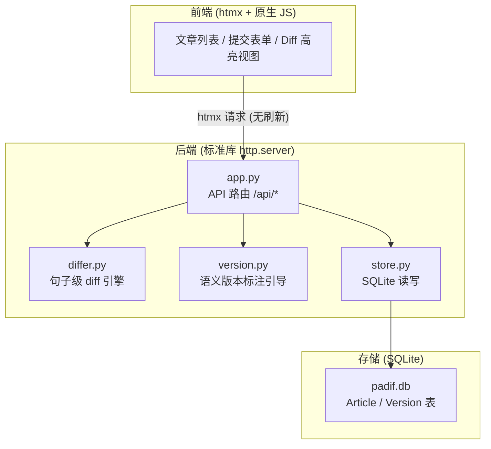
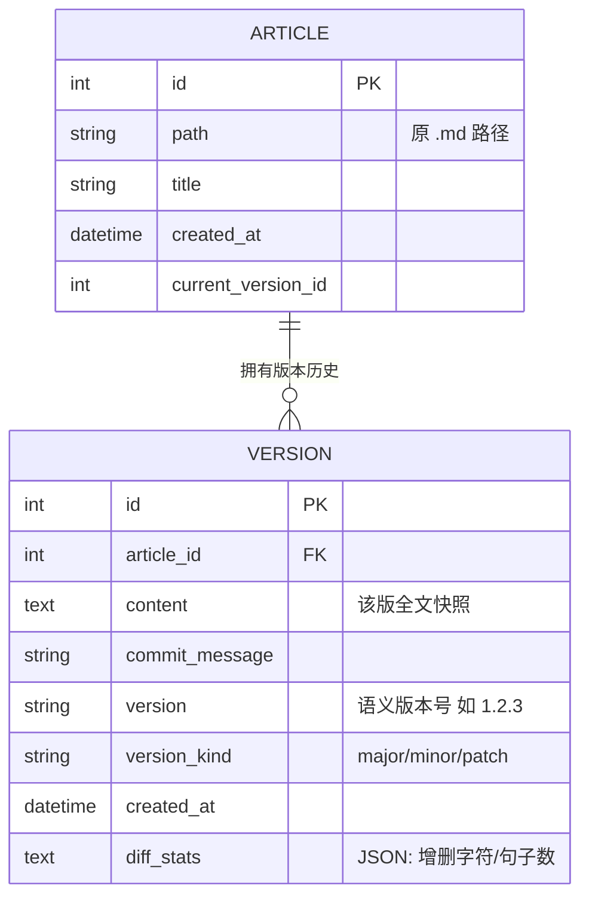
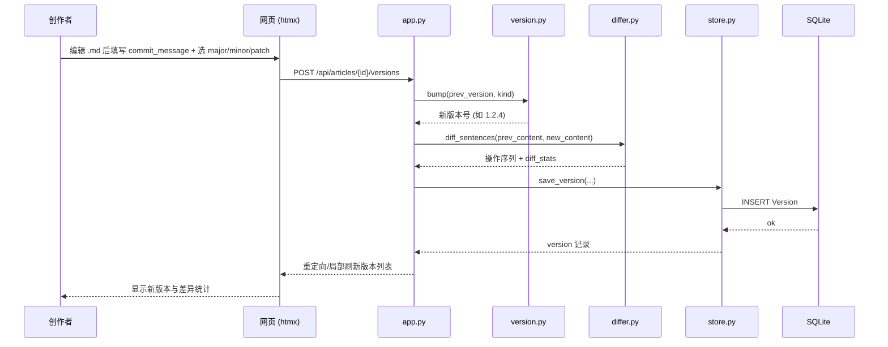
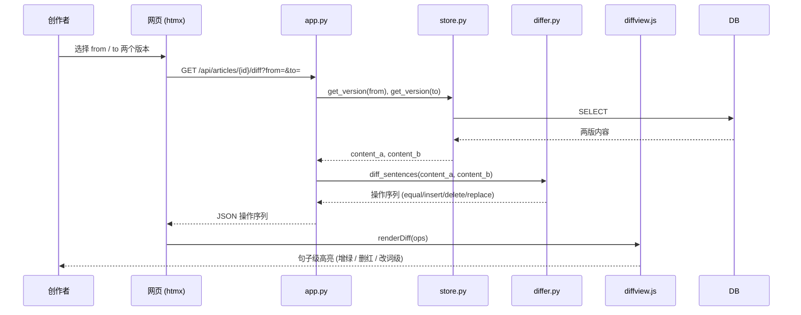
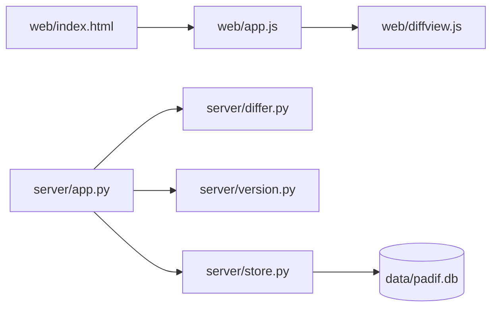

# PAdif 模块 — 开发者文档

> **模块**: `padif/`  
> **职责**: 轻量化文章版本监管与句子级差异对比工具（网页 MVP，后续可迭代为 Obsidian 插件）  
> **依赖**: Python 3.12 · 标准库 http.server · difflib · htmx · SQLite  
> **注**: 原选型为 FastAPI，但当前 managed Python 环境无法安装第三方包（OpenSSL/网络限制导致 pip 安装中断），MVP 改用标准库 `http.server` 实现，路由与业务逻辑已与框架解耦，后续可平滑迁移回 FastAPI/uvicorn。
> **创建**: 2026-07-07  
> **更新**: 2026-07-07 — v0.4：明确 Diff 粒度策略与测试集约定；CONTEXT.md 调整为本地非跟踪参考

---

## 0. 版本记录

| 版本 | 日期 | 变更 |
|------|------|------|
| v0.1 | 2026-07-07 | 初始化 `DEVELOPMENT.md`：架构图、目录映射、数据模型 ER 图、核心流程时序图、API 列表、编码规范与开发约束 |
| v0.2 | 2026-07-07 | 同步 MVP 落地状态：后端修正为「标准库 http.server」、补全实际函数名与 `/frag/*` 端点、端口 18887（支持 `PADIF_PORT`）、新增句子移动噪声与 T7 已知项、填充运行 / DB / git 附录 |
| v0.3 | 2026-07-07 | 实现并排双栏差异视图：`frag_diff` 支持 `?mode=split`，新增 `_render_split`（左栏删红、右栏增绿）；`frag_versions` 加行内/并排切换；`index.html` 补双栏样式 |
| v0.4 | 2026-07-07 | 新增 Diff 粒度策略（散文句子级 / 类代码行级 / 结构化健壮性优先）与测试集约定；CONTEXT.md 调整为本地非跟踪参考 |

---

## 1. 模块功能概述



**设计原则**
- **单向依赖**：`web/` → `app.py` → `{differ, version, store}` → SQLite。上层不得绕过下层直接访问存储。
- **轻量优先**：MVP 阶段不引入重型框架/服务进程；新增依赖须经本文件登记。
- **句子为最小单位**：diff 以标点断句，而非按行。
- **仅引导不强制**：版本标注辅助创作者，不拒绝提交。

**图例**：实线箭头表示调用/数据流向；虚线（如有）表示可选或异步。

> **环境限制（开发者须知）**：当前 managed Python（3.12.13）的 SSL 模块存在 OpenSSL 绑定缺陷，`urllib`/`requests` 等依赖 SSL 的客户端在本机可能报错；但 `curl` 对本地 HTTP 服务正常。自测请使用 `curl` 或浏览器，勿用 `urllib` 直连。FastAPI/uvicorn 亦因同样原因暂不可装。

---

## 2. 目录清单

| 文件 | 类型 | 职责 | 关键函数/类 |
|------|------|------|-------------|
| `server/app.py` | 模块 | 标准库 http.server 应用与路由编排（/api JSON + /frag htmx 片段 + 静态） | `import_markdown()`, `commit_version()`, `frag_articles()`, `frag_versions()`, `frag_diff()` |
| `server/differ.py` | 模块 | 句子级 diff 引擎 | `segment(text)`, `diff_sentences(a, b)`, `build_stats()` |
| `server/version.py` | 模块 | 语义版本标注引导 | `bump(prev, kind)`, `suggest_kind(diff_stats)`, `gentle_warn(content_a, content_b)` |
| `server/store.py` | 模块 | SQLite 读写入口 | `init_db()`, `save_article()`, `save_version()`, `get_versions()`, `get_version()` |
| `web/index.html` | 模板 | 单页骨架 + htmx 挂载点 | — |
| `web/app.js` | 脚本 | 前端交互（import/commit 用 fetch，列表/diff 用 htmx 片段委托） | `importMd()`, `selectArticle()`, `commitVersion()`, `loadArticles()` |
| `web/diffview.js` | 脚本 | diff 片段加载后客户端增强（`.rep` 提示、复制纯文本） | `copyDiffPlain()` |
| `data/padif.db` | 数据 | SQLite 版本库（运行期生成，已被 `.gitignore` 忽略） | — |
| `GUIDE-PAdif.md` | 文档 | 需求上下文与设计指南 | — |
| `DEVELOPMENT.md` | 文档 | 本开发者文档 | — |

---

## 3. 数据模型



**关键方法**
- `store.save_version(article_id, content, commit_message, kind)`：计算 `version`（基于上一版自动递增）、调用 `differ.build_stats()` 生成 `diff_stats` 后落库。
- `store.get_versions(article_id)`：按 `created_at` 升序返回版本列表。
- `differ.diff_sentences(a, b)`：返回句子级操作序列（equal / insert / delete / replace），供 `diffview.js` 渲染。

---

## 4. 详细设计（核心流程时序）

### 4.1 提交新版本



### 4.2 对比两个版本



---

## 5. API 列表

| 方法 | 路径 | 说明 | 请求体 / 参数 | 响应 |
|------|------|------|---------------|------|
| GET | `/` | 单页应用入口 | — | HTML |
| POST | `/api/articles/import` | 导入一个 `.md` 文件为 Article | `{ path }` | `{ article_id }` |
| GET | `/api/articles` | 文章列表 | — | `[{ id, title, path, current_version }]` |
| GET | `/api/articles/{id}/versions` | 某文章版本列表 | — | `[{ version, version_kind, commit_message, created_at }]` |
| POST | `/api/articles/{id}/versions` | 提交新版本 | `{ content, commit_message, version_kind }` | `{ version, diff_stats }` |
| GET | `/api/articles/{id}/diff` | 对比两版 | `?from=&to=` | `{ ops: [...] }` |
| GET | `/frag/articles` | 文章列表 HTML 片段（htmx） | — | HTML |
| GET | `/frag/articles/{id}/versions` | 版本列表 + 对比控件 HTML 片段 | — | HTML |
| GET | `/frag/articles/{id}/diff` | 差异高亮 HTML 片段（支持 `?mode=inline\|split`） | `?from=&to=&mode=` | HTML |

> 版本号由 `version.py` 依据 `version_kind` 自动递增；`commit_message` 必填非空，但不强制长度/格式。`/frag/*` 由 htmx 直接消费，服务端渲染高亮。

---

## 6. 编码规范与开发约束

本节为**开发硬约束**，所有贡献代码须遵守。

### 6.1 语言与运行时
- 后端 Python 3.12；**所有函数/方法必须带类型注解**（type hints）；路径一律用 `pathlib.Path`。
- 前端 MVP 仅用原生 HTML + **htmx**；**禁止**引入 React / Vue / Angular 等重框架（增幅阶段再评估）。

### 6.2 分层与依赖方向（单向）
- `web/` 只通过 htmx 调 `app.py` 的 HTTP 接口，**不得**直接读写 `data/`。
- `app.py` 只做编排，业务逻辑下沉到 `differ.py` / `version.py` / `store.py`。
- `store.py` 是 SQLite **唯一**出入口；其余模块**不得**直接 `sqlite3.connect`。

### 6.3 提交与版本约定
- 每次提交必须带非空 `commit_message` 与语义版本（`major`/`minor`/`patch`），由 `version.py` 辅助标注。
- **仅引导、不强制拒绝**：不对「改动太小」做阻断；仅当相对上一版几乎无变化（`gentle_warn`）时给温和提醒。

### 6.4 diff 引擎约束
- 分段单位：句末 `。！？.!?` 与空行 `\n\n`；句中 `，；、,;:` 作次级对齐。**散文正文禁止按行 diff**（句级才是 PAdif 的主价值）。
- 输出须含 `diff_stats`：`chars_added / chars_removed / sentences_added / sentences_removed`。
- 注：此约束**仅针对散文正文**；类代码内容（见 6.7）允许行级 diff。

### 6.5 轻量优先
- 不引入未确认的重型依赖；**新增依赖须记入本文件并说明理由**。
- MVP 阶段数据库用 **SQLite**；**禁止**引入 `mongod` 等服务进程（违背零安装/轻量原则）。

### 6.6 文档与图表
- 架构 / 流程 / 数据流图**一律用 Mermaid**，**禁止 ASCII art**。
- 模块变更须同步更新本文件 Section 0 版本记录。

### 6.7 Diff 粒度策略（按内容类型选择）
| 内容类型 | 推荐粒度 | 理由 |
|----------|----------|------|
| **散文 / Markdown 正文**（核心用例） | **句子级**（句末标点断句 + 句内字级高亮） | PAdif 的主价值；行 diff 会把整段标红，看不出改了哪几个字 |
| **类代码内容**（Mermaid 图、` ``` ` 源码块等） | **行级 diff 即可** | 有明确分行结构，标准 `difflib.unified_diff` 足够；对其做句子级是过度设计 |
| **其他结构化数据**（表格、JSON、YAML 等） | **健壮性优先于美观**：退化为通用块级 diff | 权衡「为每种类型单独造 diff handler 的成本」与「整块显示牺牲部分美观」——本工具选后者，不为结构化数据定制 diff，以保证系统简洁、健壮 |

- **原则**：不为边际美观需求增加系统复杂度；新增 diff 粒度前须先论证「值得额外维护成本」。

### 6.8 测试与验证集约定
- **验证集（validation）**：项目自有文档（GUIDE / DEVELOPMENT / CONTEXT）体量足够大、结构复杂，可作功能 sanity check 的验证集。
- **测试集（test fixtures）**：文档**过大，不宜直接作测试集**；须另建**小而聚焦**的测试用例（针对 `differ` 的边界：断句、句内替换、重排噪声、行级 vs 句级切换等），便于快速、确定性回归。
- 当前 MVP 以手测 + `curl` 端到端自测为主；补 focused 单测时遵循上述区分。

---

## 7. 目录依赖视图



---

## 8. 已知问题 / TODO

| 严重度 | 项 | 说明 |
|--------|----|------|
| 🟡 中 | 句子移动噪声 | 段落重排时会产生较大 `replace` 噪声；待 Phase 2 引入句子移动检测（与上一版比对已存在句） |
| 🟡 中 | 自动检测变更 | 监听文件自动提交（Phase 3）尚未实现 |
| 🟢 低 | 并排双栏 | 已实现（diff 片段支持 `?mode=split`，左删红 / 右增绿） |
| 🟡 中 | 统计摘要增强 | 当前仅有基础增删统计，待更丰富的概览（Phase 2） |
| 🟢 低 | 前端优化（T7） | 样式 / 交互 / 响应式 / 无障碍，留待收尾统一处理 |
| 🟢 低 | Obsidian 插件形态 | Phase 4，复用存储与引擎 |
| 🟢 低 | 多文章批量导入 | 当前仅单文件导入 |

---

## 9. 附录

### 9.1 本地运行
```bash
cd padif
python server/app.py                      # 默认监听 127.0.0.1:18887
PADIF_PORT=8000 python server/app.py     # 可用环境变量覆盖端口
```
浏览器打开 http://127.0.0.1:18887/ 即可使用。

### 9.2 数据库初始化
`store.init_db()` 在 `app.py` 启动时自动调用，首次运行即建好 `Article` / `Version` 表。
数据文件 `data/padif.db` 运行期生成，**已被 `.gitignore` 忽略**，不入库。

### 9.3 版本管理（git）
仓库位于 `padif/`，首个提交为 MVP 全量实现（commit `be90847`）。
`.gitignore` 忽略 `__pycache__/`、`data/*.db` 等运行期产物，保留 `data/.gitkeep`。
`CONTEXT.md` 为本地状态快照，**有意不入库**（见 `.gitignore`），仅作本地参考。

> 本文档随模块演进而更新；任何架构/接口变更须同步修改对应 Mermaid 图与版本记录。
