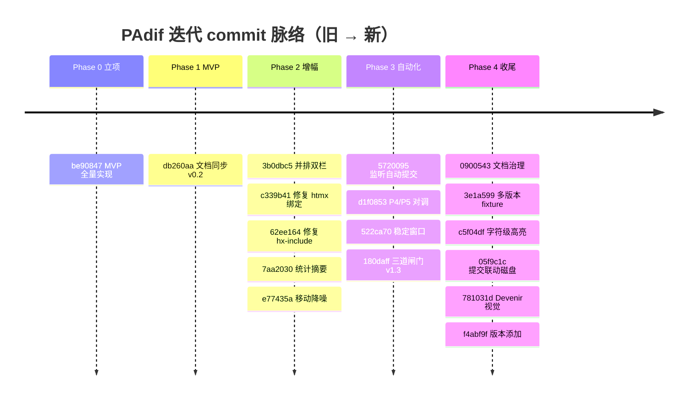

# PAdif 迭代纪事 — 从第一次对话到 V1 收尾

> **文档权限**: 迭代过程的**事实叙事**（过程记录）。技术事实以 `DEVELOPMENT.md` 为准，产品意图以 `GUIDE-PAdif.md` 为准，当下状态以 `CONTEXT.md` 为准。本文不创设新的权威域，仅把演进脉络串起来，便于回看「我们是怎么一步步走到现在的」。详见 `DOCUMENTATION_GUIDE.md`。
> **记录方式**: 所有阶段、决策、commit 均指向**已提交**实现（commit 哈希见附录），不写未落地的规划（未实现项见 `DEVELOPMENT.md` §10 TODO）。
> **创建**: 2026-07-21

---

## 0. 缘起：一个创作者的痛点

PAdif 不是凭空设计的，而是从一次很具体的对话里长出来的。

用户是深度内容创作者，用 Obsidian 管理「世界是肺」世界观。痛点很朴素也很真实：

- **散文没有「版本」**。写长文是连续的、不分行的，改了又改，但没有任何工具能让你像 git 那样「提交一版、写句说明、日后挑两版看差异」。
- **普通 diff 对散文无效**。按行的文本 diff 会把整段标红，看不出到底改了哪几个字。
- **Obsidian 自动保存会吞掉历史**。你以为在「写」，其实每次自动保存都在覆盖，旧的思路一去不回。

于是第一句话就锁定了产品形态：**一个 git 式、但为「散文/长文」设计的版本控制小工具**——`PAdif = Paragraph / Article Diff`。

四个核心约束在第一轮对话就定下了（见 `GUIDE-PAdif.md` §0，均来自用户原话）：

| 维度 | 用户的选择 |
|------|-----------|
| 内容来源 | 直接管理 `.md` 文件，按文件记录版本 |
| 版本触发 | 类 git 的「提交 + commit message」+ `major.minor.patch` 语义版本，**仅引导不强制** |
| 差异算法 | 以句号/分号等标点分段，**不是按行** |
| 应用形态 | 先网页，后 Obsidian 插件 |

> 这条线索贯穿了整个迭代：**相信创作者有自己的小巧思，工具只引导、不拦路**。后来它演化成两条更底层的产品哲学（见 §5）。

---

## 1. Phase 0 — 文档先行，选型降级

首轮对话没有立刻写代码，而是先把三份文档立起来（这是后来 `dev-doc-writer` 治理体系的雏形）：

- `GUIDE-PAdif.md`：产品意图权威源。
- `DEVELOPMENT.md`：技术事实唯一裁决（架构 / API / 数据模型）。
- `CONTEXT.md`：项目状态快照（本地非跟踪，仅作快速入场）。

**关键决策：技术选型降级**。原计划后端用 FastAPI，但 managed Python 环境无法安装第三方包（OpenSSL/网络限制），MVP 改用**标准库 `http.server` + `difflib` + htmx + SQLite**。这个降级不是妥协，而是「轻量优先」原则的第一次落地——路由与业务逻辑和框架解耦，后续可平滑迁回 FastAPI（`be90847` 之前即确立）。

---

## 2. Phase 1 — MVP 跑通（核心难点是句子级 diff）

MVP 的目标极简：**导入 .md → 提交版本（带 message + 语义版本）→ 选两版看句子级 diff**。

按任务权重排布（见 `GUIDE-PAdif.md` §7）：

- **T1 句子级 diff 引擎（30%，最高权重，核心难点）**：断句正则优先按 `。！？.!?` 与空行，逗号/分号作次级对齐；输出 `equal/insert/delete/replace` 操作序列 + `diff_stats`。这是 PAdif 的主价值，也是后续所有增幅的地基。
- T2 存储层（SQLite）、T3 语义版本引导、T4 后端 API、T5 前端 htmx UI 依次落地。
- T6 开发者文档贯穿始终。

MVP 在 `be90847` 一次性提交完成，跑通主链路。

---

## 3. Phase 2 — 增幅：从「能用」到「好用」

Phase 2 把 diff 从「单视图」扩展为「三视图」，并修掉了两个隐藏很深的 htmx 坑：

| commit | 内容 | 关键教训 |
|--------|------|----------|
| `3b0dbc5` | 并排双栏差异视图（`?mode=split`，左删红 / 右增绿） | diff 需要多种呈现才能覆盖不同阅读习惯 |
| `7aa2030` | 统计摘要视图（`?mode=stats`，字数/句数/段数/行数 + 变化量） | 创作者也需要「量化」自己的改动 |
| `c339b41` | 修复「查看差异」按钮无响应 | **htmx 坑 #1**：`innerHTML` 注入片段后浏览器不会自动重扫 `hx-*`，须显式 `htmx.process(node)` |
| `62ee164` | 修复不同版本误报「请选择两个版本」 | **htmx 坑 #2**：`hx-include` 只序列化带 `name` 属性的元素；`<select>` 缺 `name` 导致参数空发 |
| `e77435a` | 句子移动检测降噪（`moved` 操作） | 内容相同仅位置变化的句子判为「移动」并**中性渲染**，重排段落不再虚增红/绿噪声；相似度 <0.5 退化为纯增删防误配 |

> 这两个 htmx 坑后来被写进 `DEVELOPMENT.md` §8 已知问题，成为项目的「踩坑备忘录」。

---

## 4. Phase 3 — 自动化监听：把工具「放到创作者旁边」

Phase 3 是产品定位的关键转折：**PAdif 不该是另一个写作框，而该站在你 md 编辑器旁边做版本监管**。

演进分三步（对应三个 commit）：

1. **`5720095` 文件自动检测提交**：`watcher.py` 零依赖轮询（mtime + 内容 sha1），变化即自动提交 patch 版本。此时只是「能自动存」。
2. **`d1f0853` P4/P5 对调**：原 P4=Obsidian 插件、P5=T7 前端优化；用户口误「插件已在 v2 迭代」后更正为「会在 V2 迭代」，于是把 **P4 改为 T7 前端优化（V1 收尾）**、**P5 改为 Obsidian 插件（V2 产品迭代落地）**。这是一次目标重排，让 V1 主线聚焦「网页端做完做漂亮」。
3. **`522ca70` → `180daff` 三道闸门**：
   - 先加 **5s 稳定窗口**防误提交（Obsidian 自动保存的连续写入折叠为「停顿即提交」一次）；
   - 再拉长到 **30s 稳定窗口 + 180s 最小提交周期 + 关闭编辑器（如关 Obsidian）即提交**（`_WATCH_CLOSE_PROC` 默认 `Obsidian.exe`，进程由在→不在强制 flush，绕过前两道闸门）。
   - 修复了中文 Windows 下 `tasklist` 输出 GBK 致 `_editor_present` 崩溃的问题（改用字节捕获 + `errors="replace"`）。

> Phase 3 收尾时，一条产品哲学被明确写进代码与文档：**自动提交只是便利（兜底防丢），手动提交（带 message 回顾思路）才是主线**。自动 message 固定为「自动保存（文件稳定后）」，与手动提交语义清晰区分。

---

## 5. Phase 4 — 收尾优化与产品反思（V1 主线收官）

Phase 4 不再加新能力，而是把前三阶段暴露出的「不优雅」逐一打磨，并回归产品本质：

| commit | 内容 | 解决的问题 |
|--------|------|-----------|
| `0900543` | 按 `dev-doc-writer` 技能治理文档（建 `DOCUMENTATION_GUIDE.md` 权威源、加权限头、补 §4.4 差异展示 + §10 TODO） | 文档与代码开始系统性对齐，杜绝漂移 |
| `3e1a599` | 新增多版本回归 fixture（`samples/test-multiver`，4 版本覆盖 insert/moved/replace） | 之前 DB 含用户敏感草稿，清空后用干净 fixture 重建可复现测试 |
| `c5f04df` | diff 行内字符级高亮（「已→它」「不→别」歧义修复）+ split 视图只渲染本侧内容 + 统计改为实际字增/字删 | 整行泛红泛绿看不出改了哪——改成词级精确标记 |
| `05f9c1c` | **提交与监听联动**：去掉 textarea 粘贴，改为从磁盘读取 md 文件；监听即建档；自动提交带时间戳；提交前保存提醒 | 创作者主战场是自己的 md 编辑器，PAdif 不该再开一个写作框 |
| `781031d` | 前端采用 Devenir 视觉语言（暗色绿调 + CRT 扫描线 + fragment 卡片 + 悬停辉光 + 等宽标签） | 原蓝灰调与项目整体美学割裂，统一为 Devenir 设计语言 |
| `f4abf9f` | 「版本添加」功能：把另一个本地 md 文件作为指定文章的新版本追加 | 覆盖「本地留多版本 → 导入对比」场景（后端零改动，复用 `commit_version` 磁盘读取） |

**Phase 4 最重要的两个认知转折**：

1. **去粘贴化**（commit `05f9c1c`）：之前提交表单是个 textarea，等于在 PAdif 里再造一个写作框——这违背了「PAdif 站在编辑器旁边」的定位。改成从磁盘读取后，提交的就是你编辑器里那个文件的真实状态，且提交前弹「请先保存」提醒。
2. **「导入 md」不冗余**（用户拍板）：它新建文章，而「版本添加」把本地多份草稿逐一纳入同一篇文章对比，二者互补，正好服务「本地留多版本 → 导入对比」。

---

## 6. 关键决策复盘（可复用的方法论）

- **轻量优先**：managed Python 装不了包，就用标准库；不引入 `mongod` 等服务进程。每一处「不加依赖」都是主动选择。
- **仅引导不强制**：语义版本、温和提醒都不阻断提交。工具的价值是「帮你想清楚」，不是「替你做决定」。
- **自动仅便利，手动才是主线**：监听/自动提交是兜底（防丢），真正的价值在手动提交时那句 message——它让未来的你回看「当时为什么这么改」。
- **文档如实反映代码**：`dev-doc-writer` 治理后，文档权限清晰、Mermaid 化、未实现项一律 TODO，杜绝「文档写完了，代码还没动」的漂移。
- **创作者主战场是 md 编辑器**：PAdif 是「监管者」不是「替代品」。所有交互都应围绕「磁盘上的真实文件」展开。

---

## 7. 当前状态与下一步

**V1 主线已收官**：MVP（导入/提交/句子级 diff）+ 增幅（双栏/统计/移动降噪）+ 自动化（三道闸门监听）+ 收尾（Devenir 视觉/去粘贴化/版本添加）全部完成。服务运行于 `http://127.0.0.1:18887/`。

**下一步（详见 `DEVELOPMENT.md` §10 TODO 与 `GUIDE-PAdif.md` §5）**：

- **P4 / 前端优化（T7）**：V1 主线收尾的最后一块，样式/交互/响应式/无障碍/性能集中打磨。
- **P5 / Obsidian 插件形态**：计划在 V2 产品迭代落地，复用 `store` + `differ` + `version`，仅换 UI 层。
- **监听可视化反馈**：监听面板当前仅展示路径列表，可补「上次自动提交时间 / 待提交脏状态」实时指示。
- **（构想中，非本期）大模型自动摘要**：可在提交时调用 LLM 生成一句话摘要填入 message，不影响现有结构。

---

## 附录 A — 迭代 commit 时间线

> 完整列表见 `git log --oneline`；每个 commit 的功能断言均以该提交的实际代码为准。
